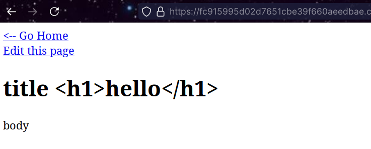
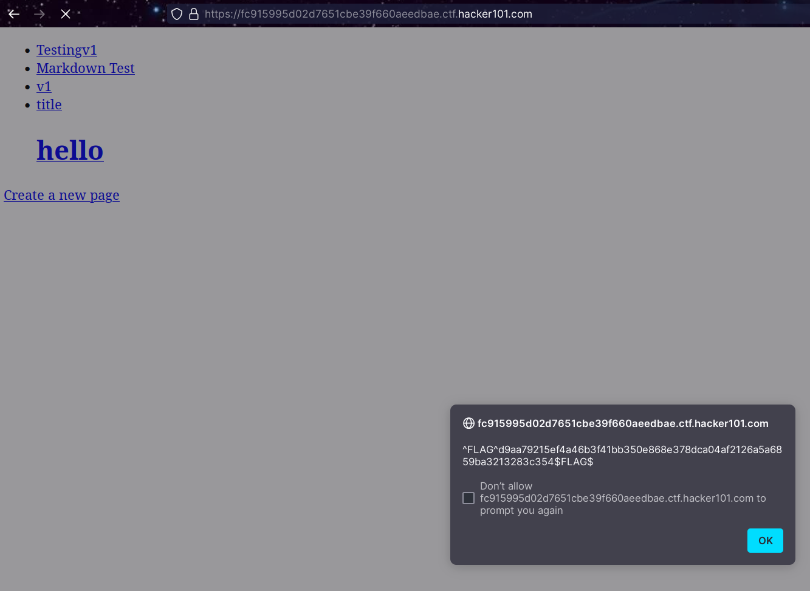

# Easy - MicroCMS

## Flag 0x01

Here we've got a simple CMS web app, we can edit existing pages with markdown text editor, we can also create new pages with the same markdown editor.

The markdown editor has a hint:
> Markdown is supported, but scripts are not

Local repo:
So I tried to inject JS and HTML random stuff, rendering of injects were parsed as expected:

Except in the pages list where the titles rendered html successfully (and potentially JS):

## Flag 0x02
## Flag 0x03
## Flag 0x04